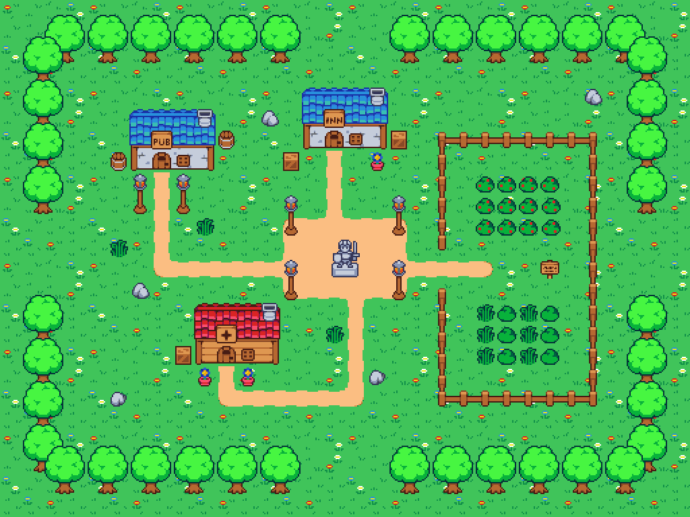

# Projeto de RPG utilizando o padrão de projeto State em Java

Este projeto foi desenvolvido como parte de um trabalho da universidade e demonstra a implementação do padrão de projeto State em Java para a criação de um jogo de RPG simples.

## Descrição do Projeto

O objetivo deste projeto é criar um jogo de RPG com funcionalidades básicas, como a movimentação do personagem principal, interação com o ambiente e combate com inimigos. O padrão de projeto State é utilizado para gerenciar o estado do personagem e controlar suas ações de acordo com o contexto do jogo.

O projeto foi implementado em Java, aproveitando os conceitos de classes, interfaces e herança para criar uma estrutura flexível e modular. Cada estado do personagem é representado por uma classe separada, que implementa a interface comum para todas as ações possíveis. Isso permite que o personagem alterne entre estados e execute diferentes comportamentos conforme as regras do jogo.

## Funcionalidades Implementadas

- Movimentação do personagem (andar para frente, para trás, para a esquerda e para a direita)
- Combate com inimigos (atacar, defender)
- Gerenciamento de pontos de vida
- Transição entre diferentes estados do personagem (Furia, Bebado, etc.)
